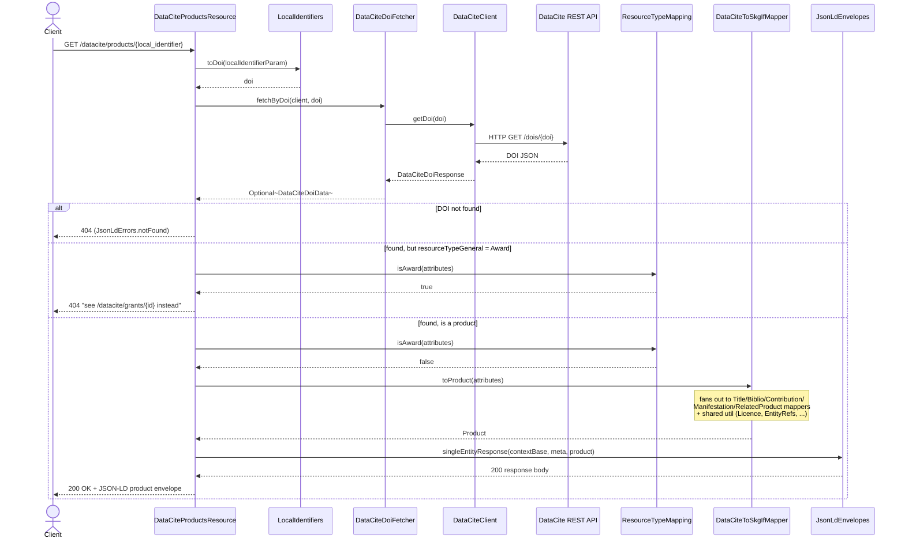
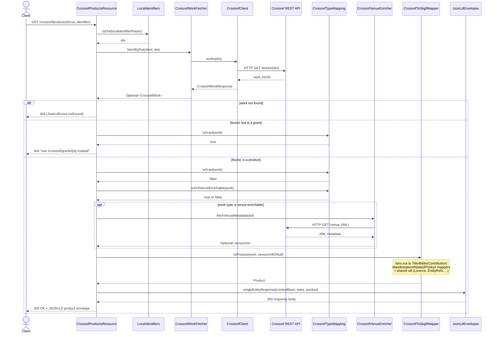
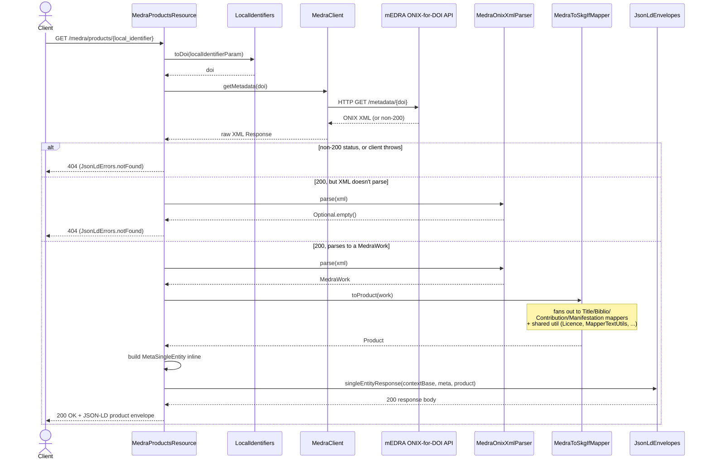

# `getProductById` request flow

One request, traced through the real code path for each registration agency. All three providers
share the same shape - resolve identifier, fetch upstream, gate by record type, map to SKG-IF,
wrap in a JSON-LD envelope - but differ in exactly where. Traced from
`src/main/java/org/skgif/doi/rest/{datacite,crossref,medra}`.

## DataCite

**What's different here:** a single upstream call, then a type gate - DataCite DOIs with
`resourceTypeGeneral: Award` are grants, not products, and get redirected to
`/datacite/grants` instead of mapped.

**What's called:**

| Component | Role |
| --- | --- |
| `DataCiteProductsResource` | REST entry point for this request - orchestrates every step below. |
| `LocalIdentifiers` | Normalizes the path param (with or without the SKG base domain) down to a bare DOI. |
| `DataCiteDoiFetcher` / `DataCiteClient` | Live REST call to DataCite's own API for the DOI record - no local storage. |
| `ResourceTypeMapping` | Gate: Award-type DOIs are grants, not products - routed away before mapping. |
| `DataCiteToSkgIfMapper` | Maps the DataCite record to an SKG-IF `Product`; fans out to field-level mappers. |
| `JsonLdLinks` / `JsonLdContextBase` / `JsonLdEnvelopes` | Assemble the `@context`/meta/`@graph` JSON-LD response by hand. |

## Crossref

**What's different here:** an optional *second* upstream call - some work types get their venue
metadata enriched from a separate XML endpoint before mapping.

**What's called:**

| Component | Role |
| --- | --- |
| `CrossrefProductsResource` | REST entry point - orchestrates every step below. |
| `LocalIdentifiers` | Normalizes the path param down to a bare DOI. |
| `CrossrefWorkFetcher` / `CrossrefClient` | Live REST call to Crossref's own API for the work record - no local storage. |
| `CrossrefTypeMapping` | Two gates: grant-vs-product, and whether this work type needs venue XML enrichment. |
| `CrossrefVenueEnricher` | Conditional second upstream call - fetches venue metadata as XML, only for enrichable types. |
| `CrossrefToSkgIfMapper` | Maps the work (+ optional venue XML) to an SKG-IF `Product`; fans out to field-level mappers. |
| `JsonLdLinks` / `JsonLdContextBase` / `JsonLdEnvelopes` | Assemble the `@context`/meta/`@graph` JSON-LD response by hand. |

## mEDRA

**What's different here:** no typed fetch layer - the client hands back raw ONIX XML directly,
which gets parsed in-resource. mEDRA also has no list endpoint, only this single-item lookup.

**What's called:**

| Component | Role |
| --- | --- |
| `MedraProductsResource` | REST entry point - single-item lookup only, no list endpoint exists for mEDRA. |
| `LocalIdentifiers` | Normalizes the path param down to a bare DOI. |
| `MedraClient` | Live call to mEDRA's ONIX-for-DOI metadata API - returns raw XML, not a typed DTO. |
| `MedraOnixXmlParser` | Parses the ONIX XML into a `MedraWork`; unparseable XML is also a 404. |
| `MedraToSkgIfMapper` | Maps the work to an SKG-IF `Product`; fans out to field-level mappers. No grant concept - ONIX-for-DOI has none. |
| `JsonLdLinks` / `JsonLdContextBase` / `JsonLdEnvelopes` | Assemble the response envelope; the single-entity meta is built inline here, unlike the other two providers. |
